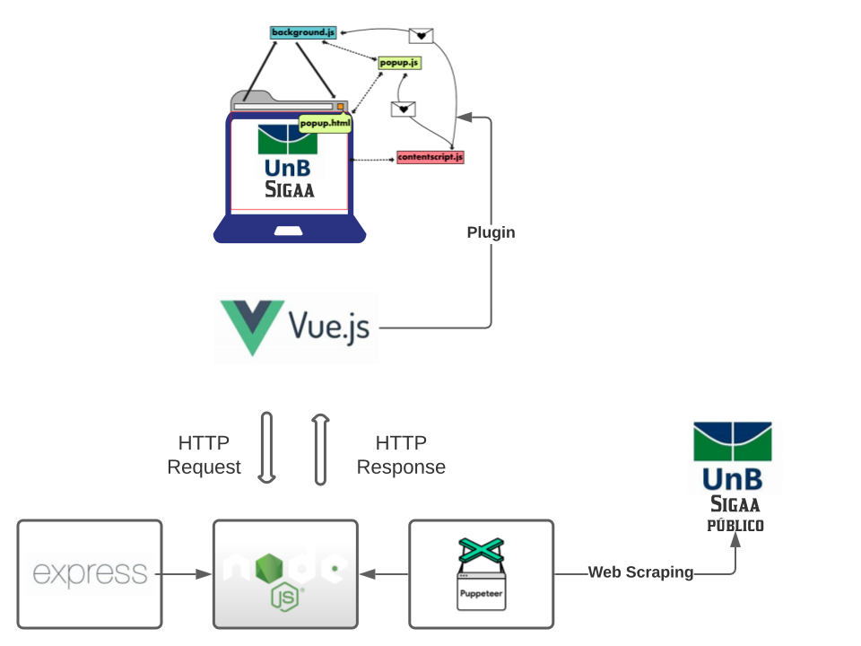
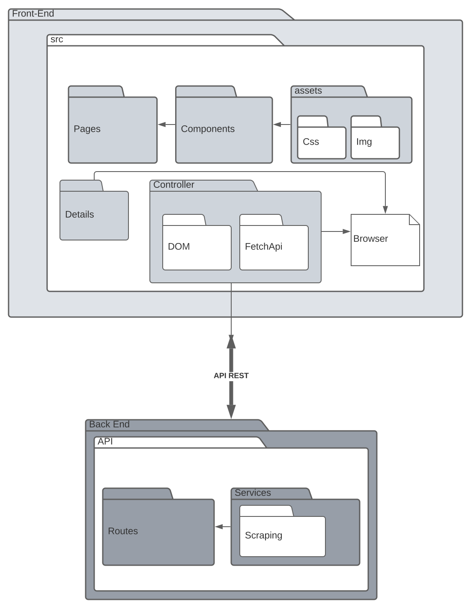

# Documento de Arquitetura

## Histórico de Revisão

| Data       | Versão | Descrição                                                                                 | Autor                                                                                     |
| ---------- | ------ | ----------------------------------------------------------------------------------------- | ----------------------------------------------------------------------------------------- |
| 01/02/2022 | 0.1    | início da criação dos tópicos da introdução                                               | [@Madu01](https://github.com/Madu01) e [@vitormanoel17](https://github.com/vitormanoel17) |
| 03/02/2022 | 0.2    | montagem da estrutura do documento e das tecnologias do tópico Representação arquitetural | [@Madu01](https://github.com/Madu01) e [@vitormanoel17](https://github.com/vitormanoel17) |
| 06/02/2022 | 0.3    | criação dos conteúdos dos subtópicos 2.1 e 2.2                                            | [@Madu01](https://github.com/Madu01) 
| 08/02/2022 | 0.4 | escopo concluído e atualização no tópico 1.3 | [@Madu01](https://github.com/Madu01) |
| 08/02/2022 | 0.5 | Revisão dos subtópicos 2.1 e 2.2 | [@Elios630](https://github.com/Elios630)|
| 25/02/2022 | 0.6  | Inserindo tópicos: Visão Geral, Diagrama de Pacotes e Visão de implentação |[@vitormanoel17](https://github.com/vitormanoel17)  |
| 27/02/2022 | 0.7 | Inserindo tópicos: Visão de Casos de Uso | [@Elios630](https://github.com/Elios630)|

## 1. Introdução

### 1.1 Escopo
Este projeto é um plugin que será aplicado ao site SIGAA para um melhor desempenho na disposição de dados para o estudante, como exibir as matérias restantes sem o trabalho do aluno, gráfico mostrando os créditos de cada modalidade e disponibilizar as equivalências de todas as matérias listadas. Esse plugin será desenvolvido por 11 alunos da UnB-Gama na disciplina Métodos de Desenvolvimento de Software. 
### 1.2 Objetivo

Este documento apresenta de forma ampla a arquitetura do software do projeto, como as tecnologias a serem utilizadas e os diagramas da visão geral da arquitetura. As informações apresentadas neste documento será de modo que guie os desenvolvedores e envolvidos a aplicar tais instruções no processo de desenvolvimento do projeto.

### 1.3 Definições, acrônimos e abreviações
| Abreviação | Significado | 
| --- | --- | 
| SIGAA | Sistema Integrado de Gestão de Atividades Acadêmicas |
| UnB | Universidade de Brasília |
| HTML | Linguagem de Marcação de Hipertexto |
| CSS | Folhas de Estilo em Cascatas |
| JavaScript |  |
| Web Scraper |  |
| DOM | Document Object Model
| API | Application Programming Interface

## 2. Representação Arquitetural

### 2.1 HTML

Em 1991 iniciou o HTML, sua abreviação é HyperText Markup Language, traduzindo para o português significa "Linguagem de Marcação de Hipertexto" e a sua versão mais recente é o HTML5, trazendo utilidades e meios para um melhor desenvolvimento web. A principal função do HTML é demarcar a estrutura de uma página da web. As estruturas demarcadas são os elementos que também são chamados de tags HTML. Na página esses elementos são textos (títulos, parágrafos e subtítulos), botões, imagens, áudios, etc..., ou seja, são hipertextos que juntos compõem a estrutura básica de uma página da web.

A estrutura das tags são iniciadas com o sinal “<”, logo depois vem o nome do elemento e terminam com o sinal “>” ` (ex.: <h1>)`. Há dois tipos de tags, as que precisam ser fechadas e as que já se fecham sozinhas. O fechamento definitivo de uma tag ocorre pela barra “/” `(ex.: <h1> Bom dia! </h1>)` e as que se fecham sozinhas não precisam da barra `(ex.: )`.

Para que o navegador consiga interpretar um documento em HTML, o arquivo deverá ter a extensão .html `(ex.: index.html)` e só assim o documento poderá ser lido e exposto por qualquer navegador web.

Essa tecnologia foi escolhida para o desenvolvimento do software do projeto por ser a estrutura mais básica na parte visual de um plugin numa página da web, nela vamos dá o início na aparência do plugin colocando a princípio os textos (títulos e subtítulos) e imagens.

### 2.2 CSS

O CSS foi apresentado em 1994, sua abreviação é Cascading Style Sheets que em português significa “Folhas de Estilo em Cascatas”, ele melhora a aparência das páginas da internet estilizando os elementos que compõem as linguagens de marcação, como XML, HTML e XHTML. A princípio o CSS foi feito para separar o conteúdo e formato de um documento da sua aparência, sua última versão apresentada é o CSS3.

A estrutura básica do CSS é formada por seletor (escolhe o elemento a ser estilizado), declaração (especifica quais das propriedades do elemento vão ser estilizados), propriedades (o atributo do elemento ao qual será aplicada a regra) e o valor da propriedade (escolhe uma dentre muitas características possíveis para uma determinada propriedade, como a cor, o fundo a formatação da letra, etc.). A imagem abaixo ilustra melhor a estrutura:

A ação do CSS é feita por um documento cujo a extensão deverá ser .css `(ex.: estilo.css)` para que o arquivo possa funcionar. O arquivo em CSS é separado do arquivo em linguagem de marcação e ocorre um processo de linkar para que o documento em CSS seja ligado ao da linguagem de marcação, assim possibilitando a estilização das páginas com linguagens como HTML, XML, etc.

Utilizaremos esta tecnologia no desenvolvimento do nosso projeto por permitir uma flexibilização maior e controle na estilização da linguagem de marcação HTML, além disso, o CSS reduz a repetição do conteúdo estrutural de uma página. Desse modo HTML seria a base que estrutura o conteúdo e o CSS seria as características visuais do conteúdo, de modo simbólico o HTML seria as bordas de uma estrutura e o CSS preencheria o meio onde não há uma estilização.

### 2.3 JavaScript

### 2.4 Web Scraper

## 3. Metas e Restrições arquiteturais

## 4. Visão de Casos de Uso

Lista de casos de uso:

- Autenticar
- Consultar fluxo
- Ver fluxo
- Consultar equivalência de matérias
- Ver créditos obrigatórios
- Ver créditos opcionais ou módulo livre
- Ver créditos totais
- Consultar créditos do curso

### 4.1 Atores

#### 4.1.1 Aluno
Usuário do sistema que terá acesso, após a autenticação, terá acesso ao fluxo, créditos e as demais funcionalidades do plugin.

### 4.2 Diagrama de caso de uso

### 4.3 Prioridade dos casos de uso

Esse diagrama expõe os seguintes requisitos: 

- RF01: Permitir que o aluno autentique em sua conta no SIGAA
- RF02: Permitir a consulta de fluxo
- RF03: Exibir o fluxo
- RF04: Permitir a consulta de matérias equivalentes
- RF05: Permitir a consulta de créditos do curso
- RF06: Exibir os créditos obrigatórios, opcionais e totais
- RNF07: O programa será um plugin
- RNF08: Suporte para os principais navegadores web
- RNF09: O plugin deve ter uma interface para o usuário
- RNF10: As informações são transmitidas de forma didática
- RNF11: O ambiente deve preservar a segurança dos dados do usuário

## 5. Visão Lógica

### 5.1 Visão Geral

Este diagrama representa uma visão macro de como as tecnologias utilizadas estarão inseridas dentro do projeto e como vão interagir.
### 5.2 Diagrama de Pacotes

Os pacotes da arquitetura foram dividos buscando um baixo acoplamento e uma divisão de responsabilidades bem definidas, e desta forma ter um software conciso.

O Front-end consiste na parte mais importante deste projeto, pois nele será implementado as principais funcionalidades que o plugin tem a oferecer. Pensando nisso foram definidos pacotes distruidos de forma que interajam de maneira organizada com o serviço do back-end e o browser. Os seguintes pacotes foram definidos:

_**Pages**_: contém a estruturação visual dos blocos que serão inseridos dentro da página do Sigaa.

_**Components**_: possue os componentes que vão constituir o corpo dos blocos, como: gráficos e botões.

_**assets**_: possue elementos como imagens e as estilizações(css) dos elementos que compõem as telas.

_**Details**_: Elementos relacionados ao popup do plugin.

_**controller**_: Constituído por dois pacotes que irão fazer o controle dos eventos, requisições e tratamento de dados. O pacote *DOM* está relacionado com o browser e o conteúdo da página, já o pacote *FetchApi* está responsável por funcionalidades relacionadas ao consumo e tratamento da api fornecida pelo serviço de back-end.

O Back-end tem um papel bem definido, fornecendo dados minerados para o front-end. Com isso temos um serviço de Api rest, onde teremos um pacote chamado *Routes* que ira definir as rotas(endPoints) da API, e o serviço de *Scraping* que está responsável por fazer a raspagem dos dados em páginas web. A forma como o back-end está definido permite que a aplicação tenha um micro-serviço capaz de ser consumido também por uma possível versão mobile deste software.
## 6. Visão de Implementação
Seguindo os conceitos estruturais apresentados anteriormente, O plugin funcionará na página logada do Sigaa, inserindo as telas que foram desenvolvidas utilizando html,css,vue.js,vue-chart.js. Partindo do principio de melhorar a visualização dos dados, serão capturados os dados do usuário por meio da manipulação do DOM (estes dados podem ser armazenados utilizando a web API localStorage, que permite guardar dados no browser localmente, sendo acessados somente em determinado dominio web) e juntamente com os dados fornecidos pela aplicação de Back-end, serão construidos os gráficos e funcionalidades de visualização de equivalências de matérias. O serviço do Back-end está responsável por realizar web scraping, utilizando a biblioteca Puppeteer, com isso realizará a raspagem de dados da página Sigaa público, e partindo destes dados minerados construirá uma api utilizando o `node.js + express`. Este serviço ira comunicar-se com o front-end seguindo os protocolos HTTP.
## 7. Referências

> Documento de Arquitetura : Acácia. Disponível em: https://fga-eps-mds.github.io/2019.2-Acacia/#/architecture_document?id=documento-de-arquitetura. Acesso em 03/02/2022;
> Documento de Arquitetura : HubCare. Disponível em: https://cjjcastro.gitlab.io/2019-1-hubcare-docs/project/architecture-document/
Acesso em 25/02/2022;
