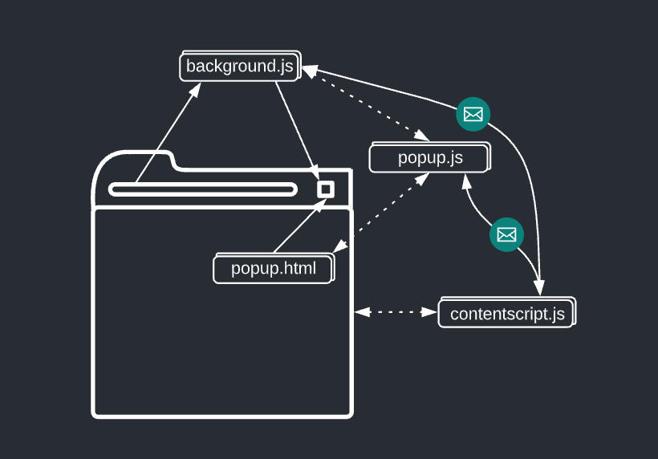

# Documento de Arquitetura

## Histórico de Revisão

| Data       | Versão | Descrição                                                                                 | Autor                                                                                     |
| ---------- | ------ | ----------------------------------------------------------------------------------------- | ----------------------------------------------------------------------------------------- |
| 01/02/2022 | 0.1    | início da criação dos tópicos da introdução                                               | [@Madu01](https://github.com/Madu01) e [@vitormanoel17](https://github.com/vitormanoel17) |
| 03/02/2022 | 0.2    | montagem da estrutura do documento e das tecnologias do tópico Representação arquitetural | [@Madu01](https://github.com/Madu01) e [@vitormanoel17](https://github.com/vitormanoel17) |
| 06/02/2022 | 0.3    | criação dos conteúdos dos subtópicos 2.1 e 2.2                                            | [@Madu01](https://github.com/Madu01) 
| 08/02/2022 | 0.4 | escopo concluído e atualização no tópico 1.3 | [@Madu01](https://github.com/Madu01) |
| 08/02/2022 | 0.5 | Revisão dos subtópicos 2.1 e 2.2 | [@Elios630](https://github.com/Elios630)|
| 25/02/2022 | 0.6 | Inserindo tópicos: Visão Geral, Diagrama de Pacotes e Visão de implentação |[@vitormanoel17](https://github.com/vitormanoel17)  |
| 27/02/2022 | 0.7 | atualização do tópico representação arquitetural e adicionamento de conteúdo no tópico metas e restrições arquiteturais | [@Madu01](https://github.com/Madu01) |
| 27/02/2022 | 0.8 | Inserindo tópicos: Visão de Casos de Uso | [@Elios630](https://github.com/Elios630)|

## 1. Introdução

### 1.1 Escopo

Este projeto é um plugin que será aplicado ao site SIGAA para um melhor desempenho na disposição de dados para o estudante, como exibir as matérias restantes sem o trabalho do aluno, gráfico mostrando os créditos de cada modalidade e disponibilizar as equivalências de todas as matérias listadas. Esse plugin será desenvolvido por 11 alunos da UnB-Gama na disciplina Métodos de Desenvolvimento de Software. 

### 1.2 Objetivo

Este documento apresenta de forma ampla a arquitetura do software do projeto, como as tecnologias a serem utilizadas e os diagramas da visão geral da arquitetura. As informações apresentadas neste documento será de modo que guie os desenvolvedores e envolvidos a aplicar tais instruções no processo de desenvolvimento do projeto.

### 1.3 Definições, acrônimos e abreviações

| Abreviação | Significado | 
| --- | --- | 
| SIGAA | Sistema Integrado de Gestão de Atividades Acadêmicas |
| UnB | Universidade de Brasília |
| HTML | HyperText Markup Language |
| CSS | Cascading Style Sheet |
| XML |  eXtensible Markup Language |
| XHTML | eXtensible Hypertext Markup Language |
| DOM | Document Object Model |
| API | Application Programming Interface |

## 2. Representação Arquitetural

### 2.1 Plugin para o Google Chrome 

Um plugin desenvolvido para o Google Chrome é um pequeno programa ou extensão com a finalidade de adicionar novas funcionalidades e recursos em outro programa principal. No caso do nosso projeto, será um plugin para o site da UnB chamado SIGAA. A base de um plugin é desenvolvido com tecnologias web (HTML, CSS e JavaScript).  

A sua arquitetura básica contém 5 arquivos, o manifest.json, popup.html, popup.js, background.js e o contentscript.js. O manifest.json passa ao navegador informações importantes sobre a extensão. O Popup.html é uma janela que sobrepõe a janela do conteúdo do programa principal feita em HTML. O Popup.js tem o domínio do controle das funcionalidades do Popup.html. O Background.js é o script dos eventos que acontecem na página e é necessário ser observado pelo plugin, o módulo dele deve ficar desabilitado quando não é usado e carregado quando for necessário. O Contentscript.js lê e modifica o DOM das páginas do programa principal. 

A imagem abaixo demonstra as relações da arquitetura dos componentes que são: 

- Elementos da interface do usuário (popup.html, popup.js e o background.js)  

- Scripts de conteúdo (popup.js, background.js e o contentscript.js) eles podem se comunicar com a extensão pai por troca de mensagens e armazenando os valores na API de armazenamento. 

### 2.2 HTML

Em 1991 iniciou o HTML, sua abreviação é HyperText Markup Language, traduzindo para o português significa "Linguagem de Marcação de Hipertexto" e a sua versão mais recente é o HTML5, trazendo utilidades e meios para um melhor desenvolvimento web. A principal função do HTML é demarcar a estrutura de uma página da web. As estruturas demarcadas são os elementos que também são chamados de tags HTML. Na página esses elementos são textos (títulos, parágrafos e subtítulos), botões, imagens, áudios, etc..., ou seja, são hipertextos que juntos compõem a estrutura básica de uma página da web.

A estrutura das tags são iniciadas com o sinal “<”, logo depois vem o nome do elemento e terminam com o sinal “>” ` (ex.: <h1>)`. Há dois tipos de tags, as que precisam ser fechadas e as que já se fecham sozinhas. O fechamento definitivo de uma tag ocorre pela barra “/” `(ex.: <h1> Bom dia! </h1>)` e as que se fecham sozinhas não precisam da barra `(ex.: )`.

Essa tecnologia foi escolhida para o desenvolvimento do software do projeto por ser a estrutura mais básica na parte visual de um plugin numa página da web, nela vamos dá o início na aparência do plugin colocando a princípio os textos (títulos e subtítulos) e imagens.

### 2.3 CSS

O CSS foi apresentado em 1994, sua abreviação é Cascading Style Sheets que em português significa “Folhas de Estilo em Cascatas”, ele melhora a aparência das páginas da internet estilizando os elementos que compõem as linguagens de marcação, como XML, HTML e XHTML. A princípio o CSS foi feito para separar o conteúdo e formato de um documento da sua aparência, sua última versão apresentada é o CSS3.

A estrutura básica do CSS é formada por seletor (escolhe o elemento a ser estilizado), declaração (especifica quais das propriedades do elemento vão ser estilizados), propriedades (o atributo do elemento ao qual será aplicada a regra) e o valor da propriedade (escolhe uma dentre muitas características possíveis para uma determinada propriedade, como a cor, o fundo a formatação da letra, etc.). O arquivo em CSS é separado do arquivo em linguagem de marcação e ocorre um processo de linkar para que o documento em CSS seja ligado ao da linguagem de marcação, assim possibilitando a estilização das páginas com linguagens como HTML, XML, etc.

Utilizaremos esta tecnologia no desenvolvimento do nosso projeto por permitir uma flexibilização maior e controle na estilização da linguagem de marcação HTML, além disso, o CSS reduz a repetição do conteúdo estrutural de uma página. Desse modo HTML seria a base que estrutura o conteúdo e o CSS seria as características visuais do conteúdo, de modo simbólico o HTML seria as bordas de uma estrutura e o CSS preencheria o meio onde não há uma estilização.

### 2.4 JavaScript

O JavaScript foi criado na década de 90. É uma linguagem de programação de alto nível, funcional, imperativa e versátil. Ele deixa o site mais interativo e dinâmico, além de controlar os elementos de um site em tempo real sem precisar receber dados ou resposta do servidor, ou seja, uma página pode ter o conteúdo atualizado sem precisar recarregá-la completamente quando for preencher um formulário. 

A utilidade principal do JavaScript é escrever scripts e funções que são adicionados em uma página HTML com atualizações das informações e interações dinâmicas com o conteúdo da página. O JavaScript pode enviar e receber dados do servidor de modo síncrono ou assíncrono com o processamento, validação e a exibição das informações em tempo real. Ele também funciona de forma localmente, diretamente do navegador do usuário.  

### 2.5 Vue.js 

O Vue.js é um framework Javascript com código aberto (open source), foi criado em 2014. Esse framework é aplicado para desenvolver interfaces e aplicações de página única (single page) que tenham interações e experiências maiores para o usuário. O Vue.js tem uma estrutura limpa e de nível fácil para o aprendizado ele também requer configuração mínima na criação de um projeto e com uma tag script simples tem a facilidade em se integrar a uma aplicação já presente. 

Esse framework favorece o isolamento e a manutenção de funcionalidades pois a sua aplicação contém componentes que são produzidos com a sintaxe HTML, CSS e JavaScript em apenas um único arquivo com extensão .vue, cada componente tem um escopo isolado tanto no estilo quanto na lógica. Os dados são renderizados de forma baseada em uma virtual DOM sendo atualizada quando os dados de um componente são alterados, resultando em um desempenho melhor e desconsiderando atualizações desnecessárias.   

### 2.6 Node.js 

O Node.js é um ambiente de execução JavaScript de forma assíncrono orientado a eventos, é definido como um interpretador server-side (ao lado do servidor), ou seja, o código é compreendido pelo servidor. Ele melhorou a linguagem JavaScript e seus motores de execução além de permitir a execução de código em JavaScript a nível front-end e back-end. 

Esse ambiente de execução é ótimo para ser utilizado como base para uma biblioteca web ou para um framework e por ele não ter operações bloqueantes nas conexões os sistemas são razoavelmente fáceis de serem criados em Node.js. No Node.js é possível reutilizar códigos fazendo com que o desenvolvimento seja mais produtivo além de ser flexível e versátil por ter capacidade de adaptação e por poder ser utilizado em vários cenários. 

### 2.7 Express.js  

O Express.js é um framework web rápido e flexível em sua aplicação para o node.js, ele é um dos frameworks mais utilizados em conjunto com o node favorecendo na produção de aplicações back-end e também em conjunto com sistemas de templates. Esse framework possui um sistema de rotas completo e a integração de sistemas de templates que propicia o desenvolvimento de páginas web para suas aplicações é permitida. 

No express.js possibilita o desenvolvimento rápido em aplicações aproveitando um conjunto pequeno de arquivos e pastas. Ele foi criado para melhorar a construção de aplicações web e APIs utilizando o node para a execução do JavaScript como linguagem de back-end. 

### 2.8 Puppeteer

O puppeter é uma biblioteca node.js de código aberto que oferece uma API de alto nível para controlar o chrome sobre o protocolo DevTools, ele é hierárquico e espelha a estrutura do navegador. As coisas que é feito manualmente em um navegador como clicar e ver dados poderá ser feita utilizando o Puppeteer.     

Essa biblioteca possibilita ser utilizado como uma ferramenta de web scraping e de automação de testes para aplicativos baseados na web. A princípio utilizaremos essa biblioteca no nosso projeto como uma ferramenta de web scraping usando o navegador chrome no modo sem cabeça para poder abrir a página e consultar todos os dados desejados. 

## 3. Metas e Restrições arquiteturais

### 3.1 Suportabilidade 

O plugin poderá ser utilizado sem problemas no navegador Google Chrome que a princípio será o navegador que suportara o sistema.  

### 3.2 Usabilidade 

O programa terá a usabilidade dinâmica e intuitiva, de modo ágil e fácil para o usuário. 

### 3.3 Tecnologias de desenvolvimento 

A principal tecnologia utilizada será o JavaScript, pois é a base do geral das outras ferramentas para o desenvolvimento do projeto, as demais são HTML, CSS, o nodeJS, a biblioteca Puppeteer e os frameworks Express JS e Vue JS. 

O Docker será implementado para facilitar e agilizar as execuções das funções e portabilidade isolando os ambientes em containers.    

### 3.4 Confiabilidade 

O plugin será testado de modo que esteja aplicável para a usabilidade sem problemas. 

## 4. Visão de Casos de Uso

Lista de casos de uso:

- Autenticar
- Consultar fluxo
- Ver fluxo
- Consultar equivalência de matérias
- Ver créditos obrigatórios
- Ver créditos opcionais ou módulo livre
- Ver créditos totais
- Consultar créditos do curso

### 4.1 Atores

#### 4.1.1 Aluno
Usuário do sistema que terá acesso, após a autenticação, terá acesso ao fluxo, créditos e as demais funcionalidades do plugin.

### 4.2 Diagrama de caso de uso

### 4.3 Prioridade dos casos de uso

Esse diagrama expõe os seguintes requisitos: 

- RF01: Permitir que o aluno autentique em sua conta no SIGAA
- RF02: Permitir a consulta de fluxo
- RF03: Exibir o fluxo
- RF04: Permitir a consulta de matérias equivalentes
- RF05: Permitir a consulta de créditos do curso
- RF06: Exibir os créditos obrigatórios, opcionais e totais
- RNF07: O programa será um plugin
- RNF08: Suporte para os principais navegadores web
- RNF09: O plugin deve ter uma interface para o usuário
- RNF10: As informações são transmitidas de forma didática
- RNF11: O ambiente deve preservar a segurança dos dados do usuário

## 5. Visão Lógica

### 5.1 Visão Geral

Este diagrama representa uma visão macro de como as tecnologias utilizadas estarão inseridas dentro do projeto e como vão interagir.
### 5.2 Diagrama de Pacotes

Os pacotes da arquitetura foram dividos buscando um baixo acoplamento e uma divisão de responsabilidades bem definidas, e desta forma ter um software conciso.

O Front-end consiste na parte mais importante deste projeto, pois nele será implementado as principais funcionalidades que o plugin tem a oferecer. Pensando nisso foram definidos pacotes distruidos de forma que interajam de maneira organizada com o serviço do back-end e o browser. Os seguintes pacotes foram definidos:

_**Pages**_: contém a estruturação visual dos blocos que serão inseridos dentro da página do Sigaa.

_**Components**_: possue os componentes que vão constituir o corpo dos blocos, como: gráficos e botões.

_**assets**_: possue elementos como imagens e as estilizações(css) dos elementos que compõem as telas.

_**Details**_: Elementos relacionados ao popup do plugin.

_**controller**_: Constituído por dois pacotes que irão fazer o controle dos eventos, requisições e tratamento de dados. O pacote *DOM* está relacionado com o browser e o conteúdo da página, já o pacote *FetchApi* está responsável por funcionalidades relacionadas ao consumo e tratamento da api fornecida pelo serviço de back-end.

O Back-end tem um papel bem definido, fornecendo dados minerados para o front-end. Com isso temos um serviço de Api rest, onde teremos um pacote chamado *Routes* que ira definir as rotas(endPoints) da API, e o serviço de *Scraping* que está responsável por fazer a raspagem dos dados em páginas web. A forma como o back-end está definido permite que a aplicação tenha um micro-serviço capaz de ser consumido também por uma possível versão mobile deste software.
## 6. Visão de Implementação
Seguindo os conceitos estruturais apresentados anteriormente, O plugin funcionará na página logada do Sigaa, inserindo as telas que foram desenvolvidas utilizando html,css,vue.js,vue-chart.js. Partindo do principio de melhorar a visualização dos dados, serão capturados os dados do usuário por meio da manipulação do DOM (estes dados podem ser armazenados utilizando a web API localStorage, que permite guardar dados no browser localmente, sendo acessados somente em determinado dominio web) e juntamente com os dados fornecidos pela aplicação de Back-end, serão construidos os gráficos e funcionalidades de visualização de equivalências de matérias. O serviço do Back-end está responsável por realizar web scraping, utilizando a biblioteca Puppeteer, com isso realizará a raspagem de dados da página Sigaa público, e partindo destes dados minerados construirá uma api utilizando o `node.js + express`. Este serviço ira comunicar-se com o front-end seguindo os protocolos HTTP.
## 7. Referências

> Documento de Arquitetura : Acácia. Disponível em: https://fga-eps-mds.github.io/2019.2-Acacia/#/architecture_document?id=documento-de-arquitetura. Acesso em 03/02/2022;
> Documento de Arquitetura : HubCare. Disponível em: https://cjjcastro.gitlab.io/2019-1-hubcare-docs/project/architecture-document/
Acesso em 25/02/2022;
