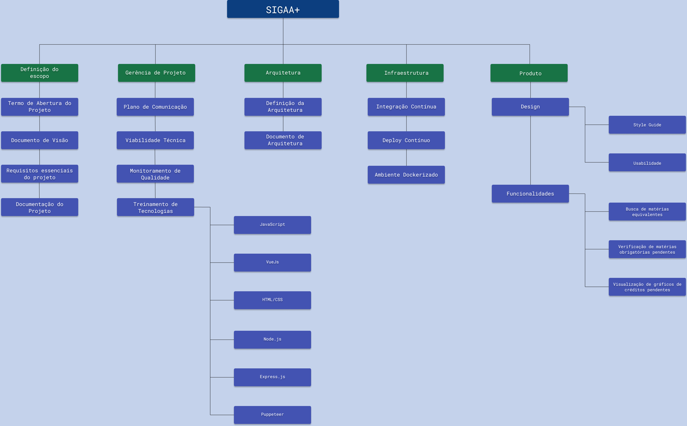

# Estrutura Analítica do Projeto

## Histórico de versão

|    Data    | Versão |             Modificação             |                   Autor                    |
| :--------: | :----: | :---------------------------------: | :----------------------------------------: |
| 21/02/2021 |  0.1   |         Inciando documento          | [@eng-Bruno](https://github.com/eng-Bruno) |
| 21/02/2021 |  1.0   | Primeira versão do documento pronta | [@eng-Bruno](https://github.com/eng-Bruno) |

## Objetivo

O objetivo deste documento é apresentar a estrutura analítica do SIGAA+, onde será mostrado como o projeto foi organizador para sua produção, mostrando como foram suas entregas, tendo assim uma visão melhor de seu gerenciamento.

---

## EAP

## Referências

- PMI. Um guia do conhecimento em gerenciamento de projetos. Guia PMBOK 5a. ed. - EUA: Project Management Institute, 2013.
