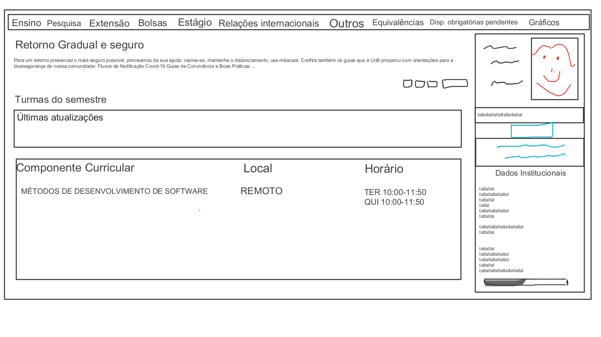
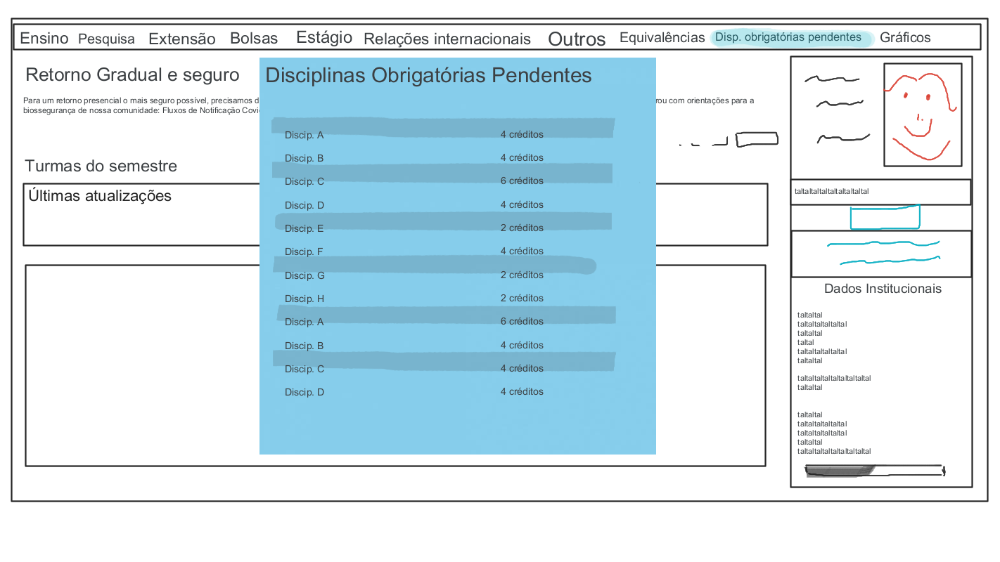
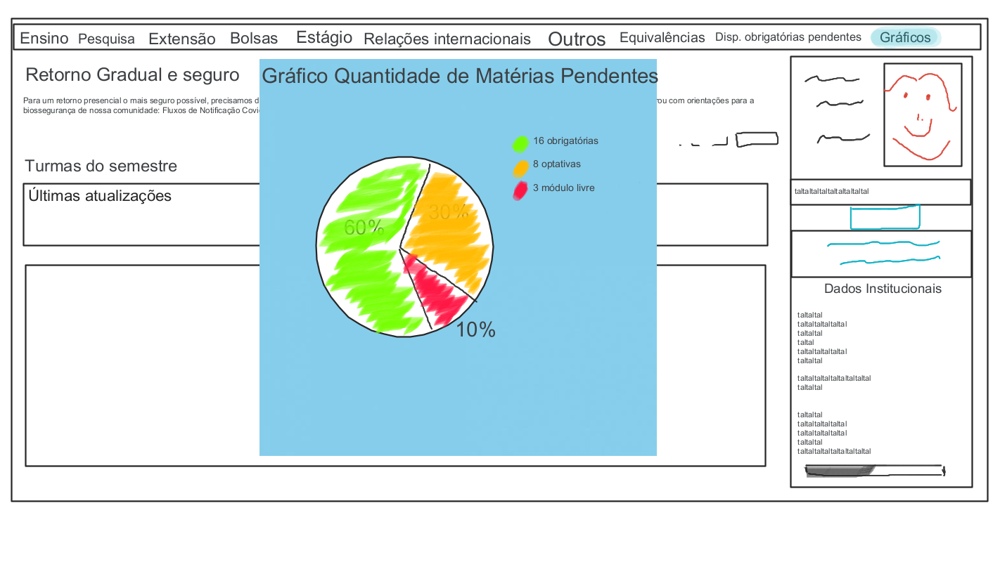

# Protótipos de Baixa e Alta Fidelidade

## Histórico de Revisão

|Data|Versão|Descrição|Autor(es)|
|:--:|:--:|:--:|:--:|
|23/02/2022|1.0|Abertura do documento e adição do tópico Protótipo de Baixa Fidelidade e seus subtópicos|[@EduardaSMarques](https://github.com/EduardaSMarques)|

## 1.Introdução

## 2.Protótipo de Baixa Fidelidade
 
O protótipo de baixa fidelidade tem o intuito de auxiliar a equipe a desenvolver estratégias e sintetizar as ideias do grupo, visando de uma maneira simples demonstrar como será a interação do usuário com o produto.

 O protótipo a seguir foi desenvolvido na ferramenta do google [Jamboard](https://jamboard.google.com/d/1ZfAj8pm_QTHrd6XwLe9oX2dpqc3AtgFuCnjfIxBTzM0/edit?usp=sharing), nele foi criado as premissas básicas do produto e as principais funcionalidades.

### 2.1 Telas

#### 2.1.1 Tela inicial do SIGAA

Esta é a primeira tela que será vista pelo usuário ao acessar o SIGAA. Na parte superior da página estará situado os botões com cada uma das funcionalidades do plugin.

#### 2.1.2 Tela de Equivalências

Esta tela aparecerá logo após o usuário clicar no botão das Equivalências, nela será mostrado as disciplinas do curso do aluno que são equivalentes. 

#### 2.1.3 Tela de Disciplinas Obrigatórias pendentes

Esta tela aparecerá logo após o usuário clicar no botão das Disciplinas obrigátórias pendentes, nela será exibido as disciplinas obrigatórias que ainda faltam ser feitas no fluxo curricular do aluno. 

#### 2.1.4 Tela de Gráfico

Esta tela aparecerá logo após o usuário clicar no botão do Gráfico, nela será mostrado um gráfico contendo a quantidade de créditos obrigatórios, optativos e de módulo livre que faltam para a conclusão do curso.

### 2.2 Fluxo do produto

## 3.Protótipo de Alta 
