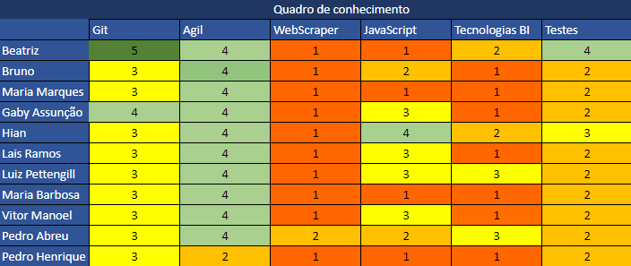

# Resultado da Sprint 0

## Visão Geral

- **Data de Início:** 18/01/2022

- **Data de Término:** 25/01/2022

- **Duração:** 1 semana

## Revisão

|                                       Issue                                       |  Status   | Pontos |
| :-------------------------------------------------------------------------------: | :-------: | :----: |
| Realizar [Treinamento de github](https://github.com/fga-eps-mds/Tema-02/issues/7) | Concluída |   1    |

---

## Quadro de conhecimento

O quadro de conhecimentos do grupo é apresentado numa escala de 1 a 5, com o número 1 representando baixo conhecimento e o número 5 representando alto conhecimento sobre determinada ferramenta.

---

## Análise do Scrum Master

Durante a semana o grupo fez pesquisas e estudou sobre as funcionalidades do GitHub, para ter um melhor conhecimento sobre a ferramenta que será utilizada durante todo o desenvolvimento do projeto.

A sprint atingiu a proposta apresentada.
