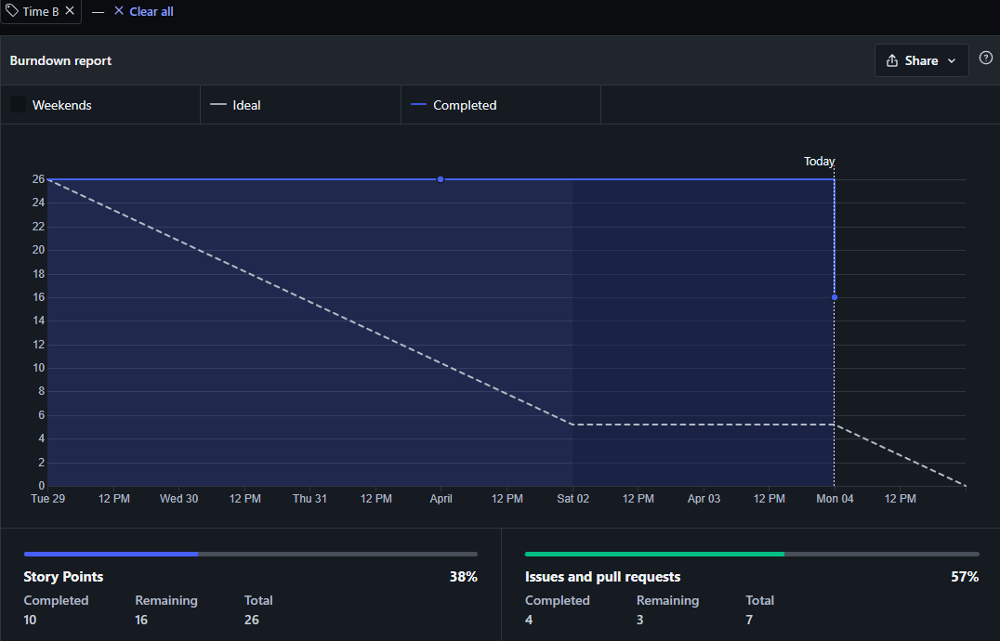
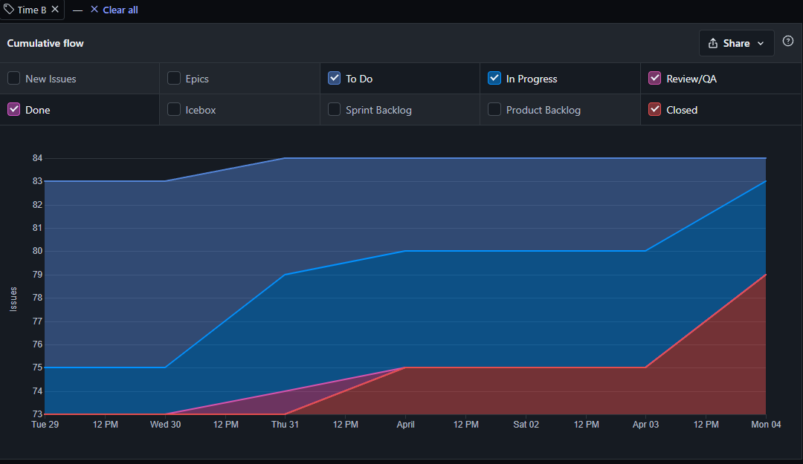

# Resultado da Sprint 10

## Visão Geral

- **Data de Início:** 29/03/2022

- **Data de Término:** 04/04/2022

- **Duração:** 1 semana

## Revisão - Time B

|                                                  Issue                                                   |   Status   | Pontos |
| :------------------------------------------------------------------------------------------------------: | :--------: | :----: |
|      [Documentação Sprint 10 - Time B](https://github.com/fga-eps-mds/2021.2-Sigaa-Plus/issues/212)      | Concluída  |   1    |
|              [Atualizar EAP ](https://github.com/fga-eps-mds/2021.2-Sigaa-Plus/issues/172)               | Concluída  |   2    |
|  [Início do desenvolvimento do Dropdown ](https://github.com/fga-eps-mds/2021.2-Sigaa-Plus/issues/215)   | Incompleta |   8    |
|       [Desenvolvimento Progress Bar ](https://github.com/fga-eps-mds/2021.2-Sigaa-Plus/issues/214)       | Concluída  |   8    |
| [Desenvolvimento back-end para os gráficos](https://github.com/fga-eps-mds/2021.2-Sigaa-Plus/issues/216) | Incompleta |   8    |
|       [Resultado Sprint 10 - Time B](https://github.com/fga-eps-mds/2021.2-Sigaa-Plus/issues/213)        | Concluída  |   1    |

## Burndown - Time B

## Cumulative Flow - Time B

## Análise do Scrum Master

Durante a Sprint 10 o Time B focou em dar continuidade ao desenvolvimento dos requisitos funcionais 03, 04 e 05. Além disso parte do time B pareou com o time A para fazer o desenvolvimento dos componentes visuais do requisitos funcionais 01 e 02.
