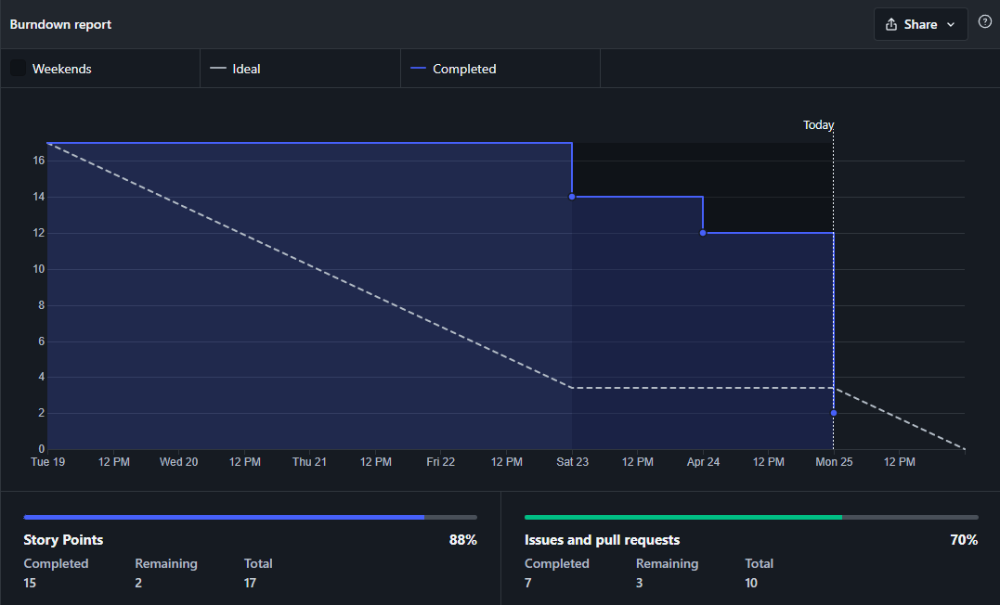
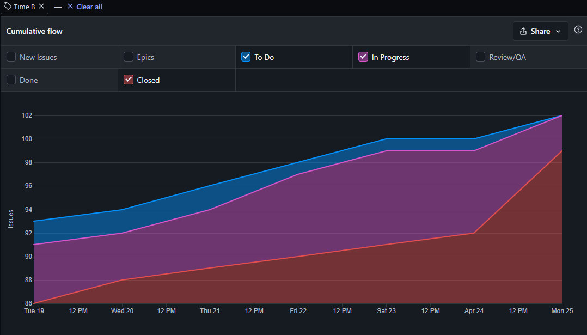

# Resultado da Sprint 13

## Visão Geral

- **Data de Início:** 19/04/2022

- **Data de Término:** 25/04/2022

- **Duração:** 1 semana

## Revisão - Time B

|                                                    Issue                                                     |   Status   | Pontos |
| :----------------------------------------------------------------------------------------------------------: | :--------: | :----: |
|        [Planejamento Sprint 13 - Time B](https://github.com/fga-eps-mds/2021.2-Sigaa-Plus/issues/278)        | Concluída  |   1    |
|              [Atualizar gh-pages ](https://github.com/fga-eps-mds/2021.2-Sigaa-Plus/issues/245)              | Concluída  |   3    |
|            [Dropdown de navegação ](https://github.com/fga-eps-mds/2021.2-Sigaa-Plus/issues/272)             | Incompleta |   5    |
| [Integração do Back-end e do Front-end da RF02](https://github.com/fga-eps-mds/2021.2-Sigaa-Plus/issues/201) | Concluída  |   5    |
|        [Planejamento Sprint 12 - Time B](https://github.com/fga-eps-mds/2021.2-Sigaa-Plus/issues/279)        | Concluída  |   1    |
|     [Atualizações na parte visual da RF02](https://github.com/fga-eps-mds/2021.2-Sigaa-Plus/issues/287)      | Concluída  |   2    |
|    [Atualizar o Style Guide do GitHub pages](https://github.com/fga-eps-mds/2021.2-Sigaa-Plus/issues/276)    | Concluída  |   3    |
|    [Correção do protótipo de alta qualidade](https://github.com/fga-eps-mds/2021.2-Sigaa-Plus/issues/276)    | Concluída  |   2    |

## Burndown - Time B

## Cumulative Flow - Time B

## Análise do Scrum Master

Durante a Sprint 13 o Time B focou em se juntar com o Time A para fazer a finalização do projeto, terminar as integrações e atualizar o documentos restantes para fazer a entrega da Release 02.
