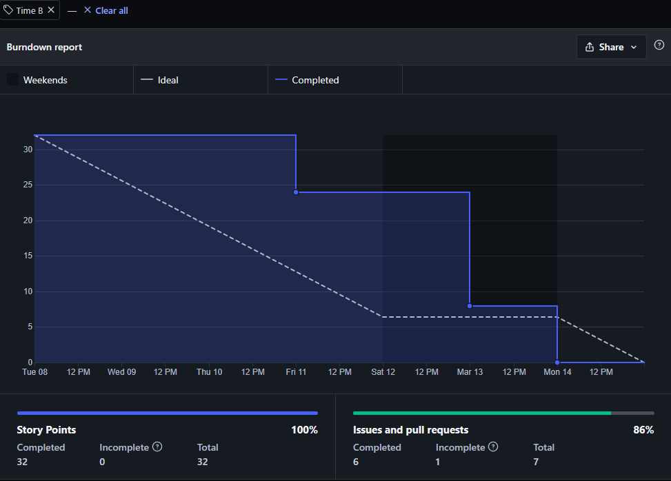
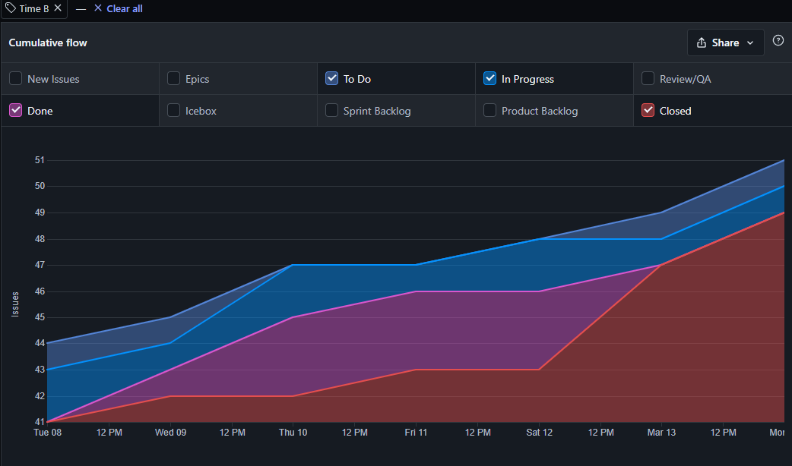

# Resultado da Sprint 7

## Visão Geral

- **Data de Início:** 08/03/2022

- **Data de Término:** 14/03/2022

- **Duração:** 1 semana

## Revisão - Time B

|                                              Issue                                              |  Status   | Pontos |
| :---------------------------------------------------------------------------------------------: | :-------: | :----: |
|  [Planejamento Sprint 7 - Time B](https://github.com/fga-eps-mds/2021.2-Sigaa-Plus/issues/148)  | Concluída |   5    |
|     [Template para as Dailys](https://github.com/fga-eps-mds/2021.2-Sigaa-Plus/issues/145)      | Concluída |   2    |
| [Planejamento do Dojo (Front-end)](https://github.com/fga-eps-mds/2021.2-Sigaa-Plus/issues/141) | Concluída |   1    |
|            [Dojo VueJS](https://github.com/fga-eps-mds/2021.2-Sigaa-Plus/issues/142)            | Concluída |   8    |
|          [Dojo do Plugin](https://github.com/fga-eps-mds/2021.2-Sigaa-Plus/issues/154)          | Concluída |   5    |
|          [Dojo HTML/CSS](https://github.com/fga-eps-mds/2021.2-Sigaa-Plus/issues/146)           | Concluída |   8    |
|         [Dojo JavaScript](https://github.com/fga-eps-mds/2021.2-Sigaa-Plus/issues/155)          | Concluída |   8    |

## Burndown - Time B

## Cumulative Flow - Time B

## Análise do Scrum Master

Durante a Sprint 7 o Time B focou em estudar as tecnologias front-end para fazer a realização dos dojos de treinamento para toda a equipe. Todos os dojos estão disponíveis em suas respectivas issues. Além disso focamos em melhorar a organização do time.
