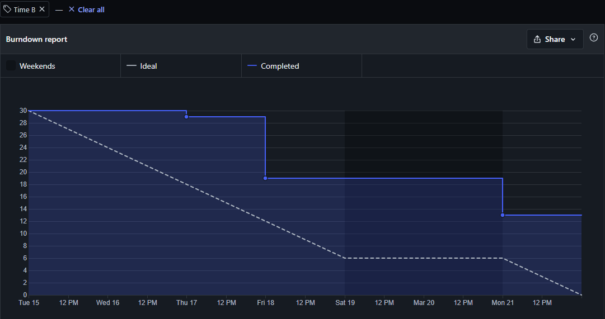
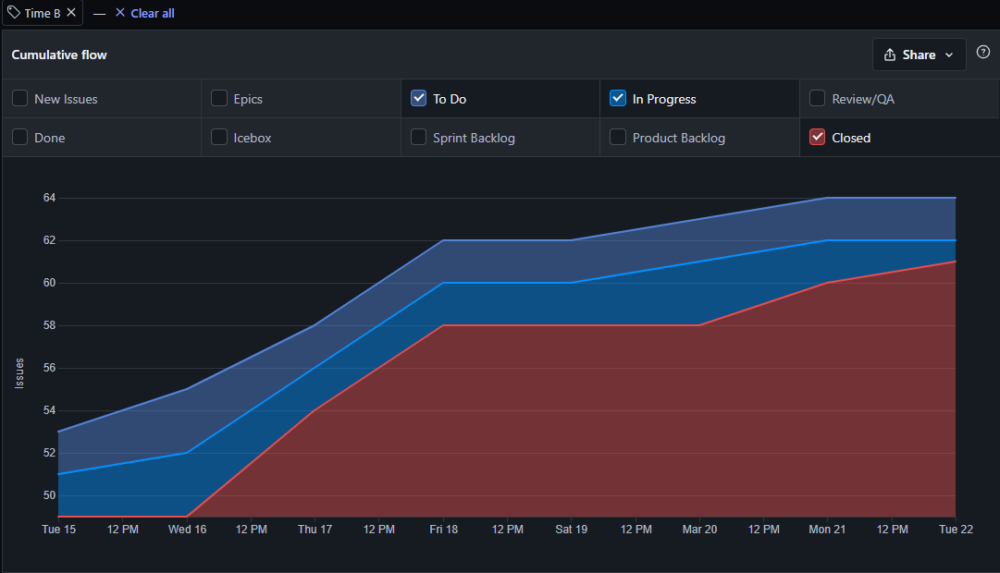

# Resultado da Sprint 8

## Visão Geral

- **Data de Início:** 15/03/2022

- **Data de Término:** 21/03/2022

- **Duração:** 1 semana

## Revisão - Time B

|                                              Issue                                              |  Status   | Pontos |
| :---------------------------------------------------------------------------------------------: | :-------: | :----: |
|  [Documentação Sprint 8 - Time B](https://github.com/fga-eps-mds/2021.2-Sigaa-Plus/issues/169)  | Concluída |   1    |
|      [Documento Style Guide ](https://github.com/fga-eps-mds/2021.2-Sigaa-Plus/issues/170)      | Concluída |   5    |
|   [Apresentação - Style Guide ](https://github.com/fga-eps-mds/2021.2-Sigaa-Plus/issues/185)    | Concluída |   3    |
| [Detalhes e motivos - Style Guide](https://github.com/fga-eps-mds/2021.2-Sigaa-Plus/issues/180) | Concluída |   2    |
|    [Componentes - Style Guide](https://github.com/fga-eps-mds/2021.2-Sigaa-Plus/issues/177)     | Concluída |   3    |
|  [Documentação Sprint 6 - Time B](https://github.com/fga-eps-mds/2021.2-Sigaa-Plus/issues/173)  | Concluída |   1    |

## Burndown - Time B

## Cumulative Flow - Time B

## Análise do Scrum Master

Durante a Sprint 8 o Time B focou em melhorar o conhecimento das tecnologias front-end para posteriormente dar início ao desenvolvimento do plugin. Além disso o time atualizou alguns documento pendentes. Não foi possível melhorar alguns documentos por falta de comunicação.
