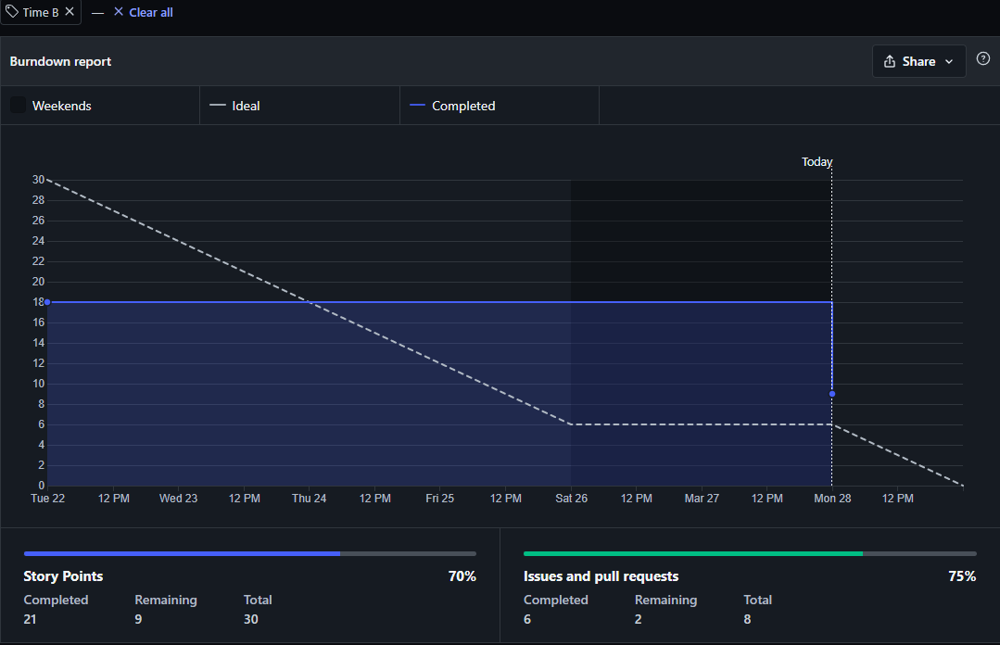
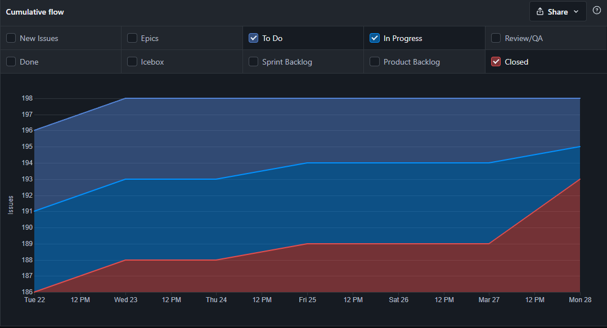

# Resultado da Sprint 8

## Visão Geral

- **Data de Início:** 15/03/2022

- **Data de Término:** 21/03/2022

- **Duração:** 1 semana

## Revisão - Time B

|                                               Issue                                                |   Status   | Pontos |
| :------------------------------------------------------------------------------------------------: | :--------: | :----: |
|   [Documentação Sprint 9 - Time B](https://github.com/fga-eps-mds/2021.2-Sigaa-Plus/issues/196)    | Concluída  |   1    |
|           [Atualizar EAP ](https://github.com/fga-eps-mds/2021.2-Sigaa-Plus/issues/172)            | Concluída  |   2    |
|        [Desenvolvimento RF03 ](https://github.com/fga-eps-mds/2021.2-Sigaa-Plus/issues/205)        | Incompleta |   8    |
|     [Desenvolvimento RF04 e RF05](https://github.com/fga-eps-mds/2021.2-Sigaa-Plus/issues/201)     | Concluída  |   8    |
|     [Resultado Sprint 9 - Time B](https://github.com/fga-eps-mds/2021.2-Sigaa-Plus/issues/177)     | Concluída  |   3    |
| [Refinar Protótipo de Alta Qualidade](https://github.com/fga-eps-mds/2021.2-Sigaa-Plus/issues/178) | Concluída  |   5    |
|        [Cirar novo Protótipo](https://github.com/fga-eps-mds/2021.2-Sigaa-Plus/issues/206)         | Concluída  |   3    |

## Burndown - Time B

## Cumulative Flow - Time B

## Análise do Scrum Master

Durante a Sprint 9 o Time B focou em dar inicio ao desenvolvimento dos requisitos funcionais 03, 04 e 05.
